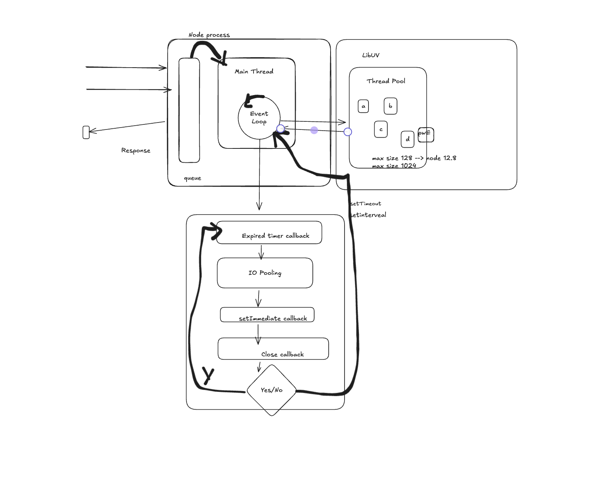
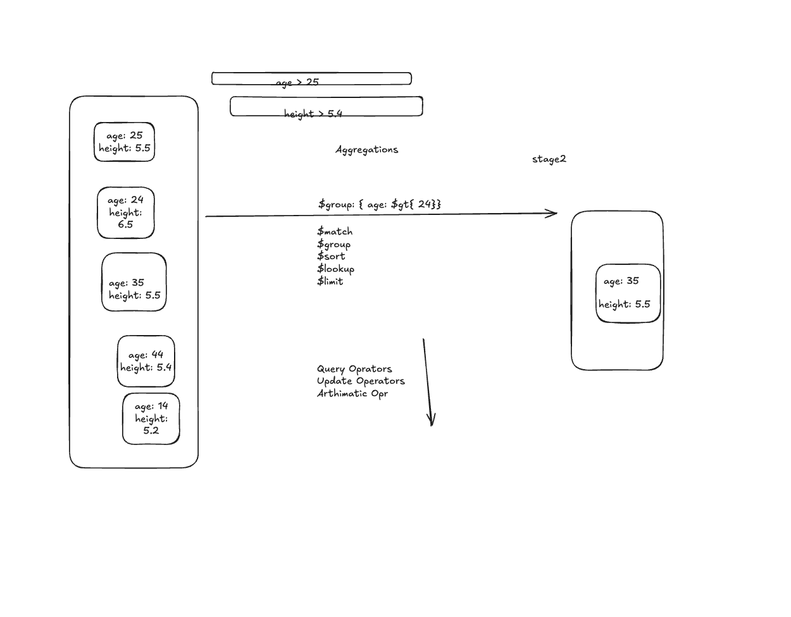
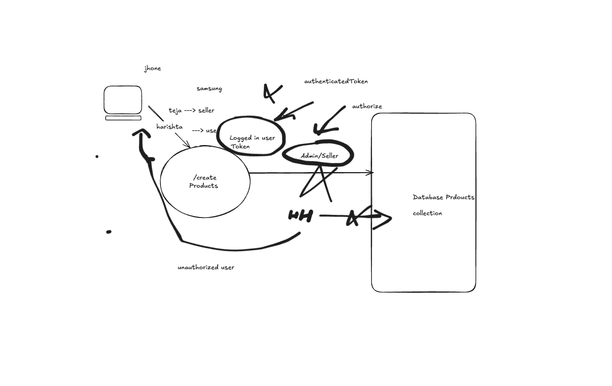
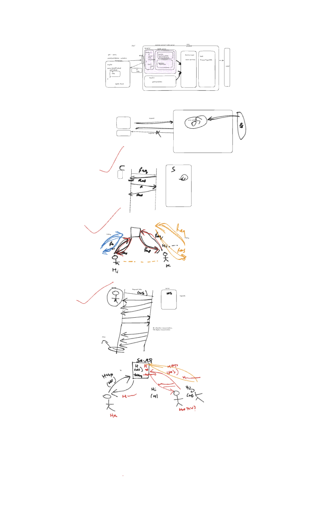

# Node.js Project

## Task
1. Add a video or audio file to the project directory.
2. Use the `fs` module to read the file.
3. Put and Delete APIs

## Software to install:
Node js, Postman 

## Node.js Process


## Instructions to Run the Project
1. Open the **Project Folder** in the terminal.
2. Install dependencies:
   ```sh 
   npm install

## This will install:
1. Production dependencies: dotenv, express
2. Development dependencies: typescript, @typescript-eslint/eslint-plugin

## Start the application:
   ```sh
   npm run start
 








## Rest API url
http://localhost:3000/api/users/login ---> success --> accessToken
http://localhost:3000/api/products---> Postman header ==> authorization : Bearer <accessToken>